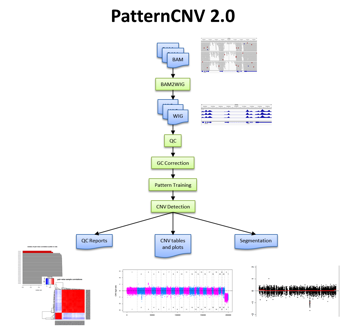

.. PatternCNV Documentation documentation master file, created by
   sphinx-quickstart on Thu Jul 25 21:04:47 2019.
   You can adapt this file completely to your liking, but it should at least
   contain the root `toctree` directive.

=============================================================
Welcome to PatternCNV Pipeline Documentation!
=============================================================

.. toctree::
   :maxdepth: 2
   :caption: Contents:

Introduction
============

PatternCNV is a versatile tool used for detecting Copy Number Variations
(CNVs) from either germline or tumor/normal pairs of Exome-Seq samples.
The “Pattern” stands for the method PatternCNV uses to calculate the
common coverage trends from multiple Exome-seq samples. PatternCNV can
be run using a simple wrapper script which starts with BAM files and
then performs all of the necessary QC, CNV detection, and visualizations
in one easy-to-use command. The internal methods of PatternCNV consist
of two basic components: 1) BAM2WIG conversion implemented with Perl and
Bash scripts which convert large BAM files to the lightweight WIG
format, allowing for less computationally intense read-depth comparisons
and simpler coverage visualization; 2) a set of CNV functions
implemented in R which use the WIG files to facilitate QC, GC bias
correction, coverage-pattern learning, CNV calling, segmentation, and
various post-processing and visualization functions. To avoid garbage-in
garbage-out situations, multiple QC checks and reports are included in
the tool and should be examined before using the CNV results. After
running PatternCNV, users can investigate CNVs through interactive
visualization or detailed CNV tables.

PatternCNV can be run in both Linux and Mac environments. The source
code, along with user manual and example data can be downloaded from the
PatternCNV website:

http://bioinformaticstools.mayo.edu/research/patterncnv/

Citation
========

Please cite the following publication when using PatternCNV:

Wang, C., J. M. Evans, et al. (2014). **PatternCNV: a versatile tool for
detecting copy number changes from exome sequencing data.**
*Bioinformatics* 30(18): 2678-2680.

PubMed link: http://www.ncbi.nlm.nih.gov/pubmed/24876377

Frequently Asked Questions (FAQ)
================================

**How many samples do I need to run PatternCNV?**

PatternCNV requires at least 3 Germline samples in order to compute the
average reference pattern, however it is recommended to have at least
5-10 samples. If the use only has one Tumor/Normal pair then PatternCNV
will use a simpler subtraction method to detect Somatic CNVs.

**What log2ratio cutoff should I use for filtering CNVs?**

This greatly depends on the quality and type of data, but typically <=
-0.65 for a deletion and >= 0.45 for a duplication are decent cutoffs
for standard whole exome data.

**What does this error in the bam2wig job mean? ERROR! wig line count
doesn't match expected count from exon key**

This error is most often caused from using different chromosome or
contig naming conventions between BAMs and reference files. Make sure
that the chromosome nomenclature is the same in your BAMs, reference
genome FASTA, Exon BED, and Capture kit BED. (eg 1,2,3,4 vs
chr1,chr2,chr3,chr4)

**What Signal-to-Ratio (SNR) cutoff should I use for filtering CNVs?**

The SNR for each exon is calculated as
20*log10(avg.coverage/SD.coverage). An SNR cutoff of >= 8-10 is decent
for typical whole exome data. The autosome plots and segmentation
results automatically use an SNR cutoff of >= 10.

**Can PatternCNV be used for detecting CNVs in custom capture data?**

Yes, PatternCNV performs well using custom capture data

**Can PatternCNV be used for detecting CNVs in whole genome sequencing
data?**

No, whole genome sequencing data doesn’t have the same coverage pattern
consistencies of exome capture data.

**Can I use exome samples from multiple capture kits at the same time?**

No, different capture kits don’t have the same coverage patterns.
Samples from different capture kits should be analyzed in separate
PatternCNV runs.

Indices and tables
==================

* :ref:`genindex`
* :ref:`modindex`
* :ref:`search`
